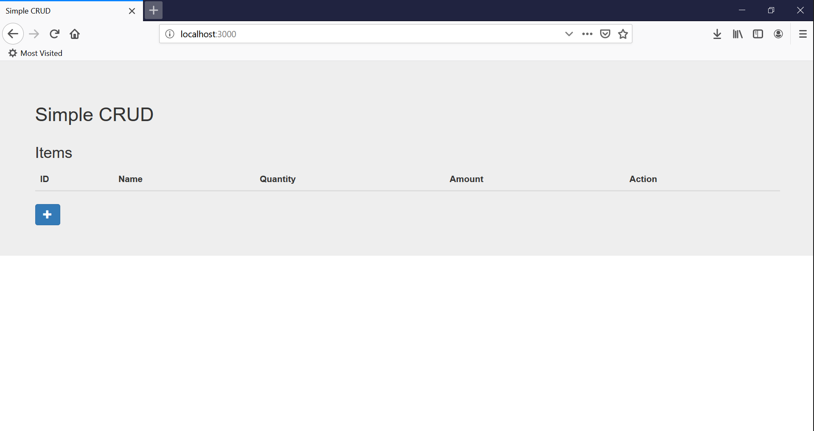
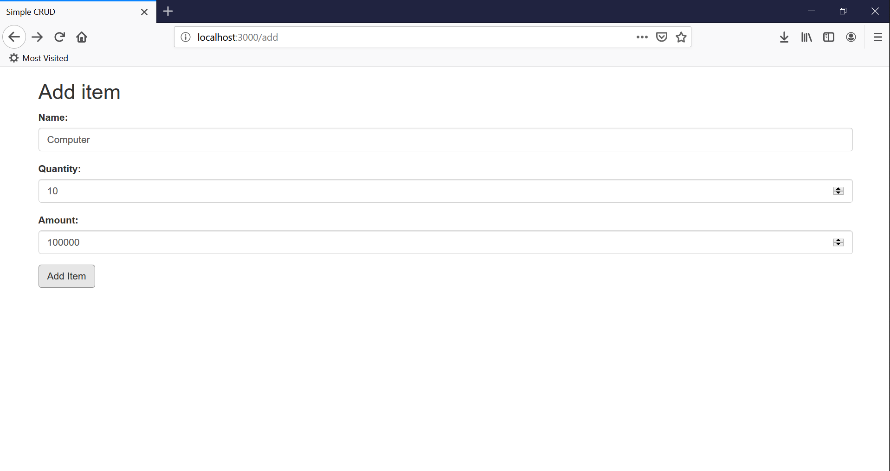
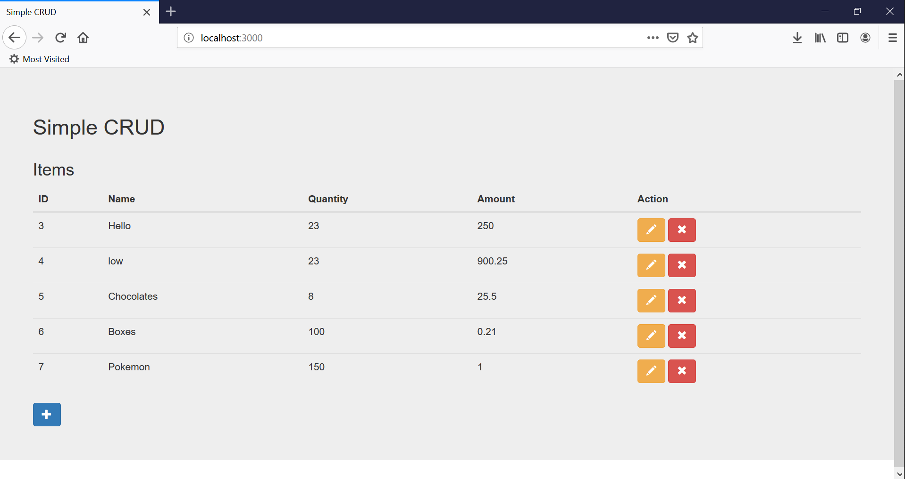

# SimpleCRUD
This is a repository of a simple CRUD implementation on NodeJS in fulfillment of the application for Questronix
## Prerequisites
Before running the application, certain prerequisites must be installed. [NodeJS](https://nodejs.org/en/) must be installed in your computer. Install the required packages for NodeJS using `npm install package_name`.  
#### NodeJS packages
1. express
2. mysql
3. ejs
4. body-parser
5. method-override  
MySQL should also be installed in the computer. However, before running the app, MySQL should be configured to match the application. In developing the application, MySQL using [XAMPP](https://www.apachefriends.org/index.html) for Windows was used however it will also work on MySQL in Linux. Once installed, the following procedure is done to create a user and database in MySQL. The *items* table is created the application is running.
#### MySQL commands
```
# mysql -u root
MariaDB [(none)]> GRANT ALL PRIVILEGES ON *.* TO 'user'@'localhost' IDENTIFIED BY 'user';
MariaDB [(none)]> CREATE DATABASE inventory;
```
## Usage
Once you downloaded or clone the repository and followed the prerequisites, you can now run the application using the following command.  
```
node apps.js
```
The application can be accessed at [http://localhost:3000/](http://localhost:3000/). Once you accessed the application, you will be directed into the application homepage. Initially it will look like the following image since there are no items in the inventory yet.  
  
To add a new item, just click on the + button and it will redirect you to a new page where you can fill up the form fields to add an item. Shown below is a sample screenshot of the page.  

Once you've added items on your inventory, the homepage will look like the following image. To update a specific item in your inventory, you can click on the pencil button to edit information about that item. To delete that item, just click on the x button.

The update item page is similar to that of the add item page except when you are redirected in the update item page, it automatically fills up the form with the current details of the item for easier editing as shown in the following image.

## Explanation
##### [apps.js](apps.js)
This is the main file which contains the initializing of the required packages, connecting to the MySQL server, and starting the express server. 
##### [crud.js](api/crud.js)
This is the api for the simple CRUD implementation. Most of these functions are implemented by interfacing with the MySQL database.
##### [routes.js](api/routes.js)
This is where the routing information of the current application is located. 
##### [views](views/)
This is where the front end implementation of the application is located.
